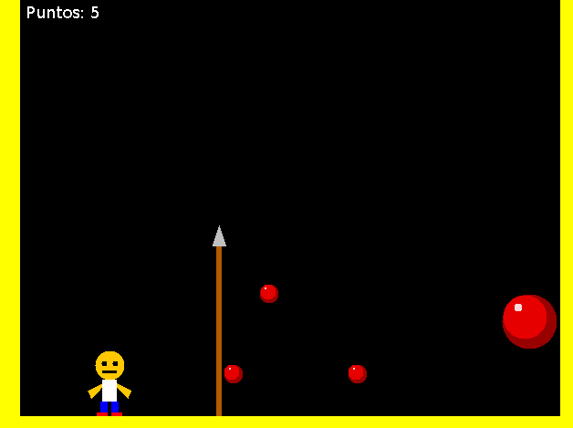

MOOPang (2011 Mario Macías)
=======

Sencillo videojuego, especialmente ideado para estudiantes de Programación
Orientada a Objetos e Ingeniería del Software.

Compilación y ejecución
-----------------------
Desde la consola, ves al directorio raíz del proyecto y escribe:

ant run

Modo de juego
-------------
Usa las teclas de cursor <- y -> para moverte de izquierda a derecha.
Usa la barra espaciadora para lanzar flechas que romperán las bolas que caen del
techo.
Cada vez que rompas una bola, ésta se dividirá en dos bolas más pequeñas. Cuando
rompas una bola de las más pequeñas, ésta desaparecerá para siempre.
Si una bola te toca, se acaba el juego.

Captura de pantalla
-------------------

